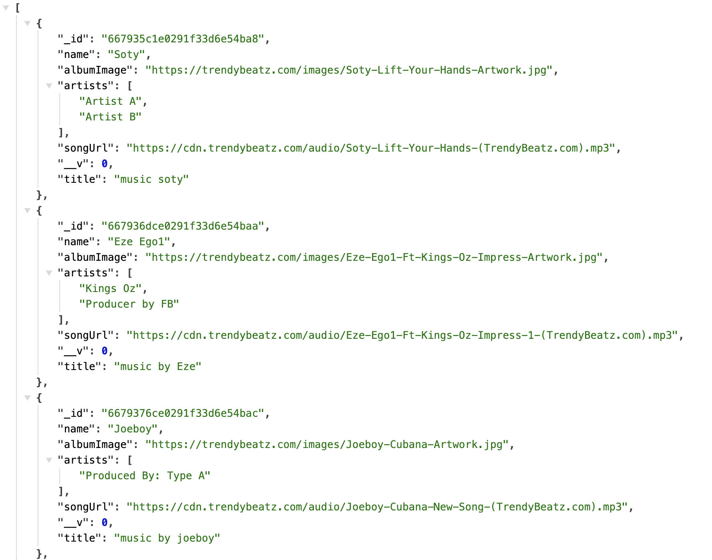
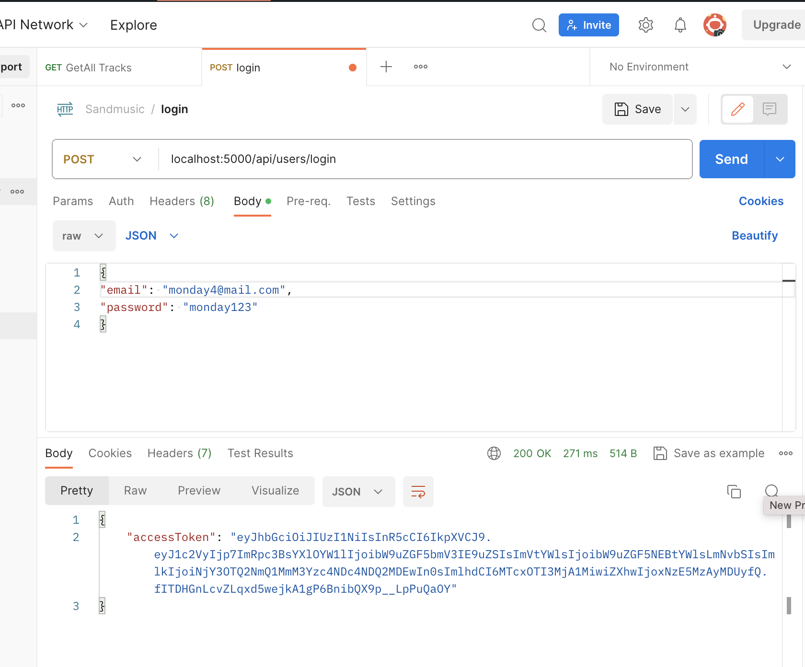
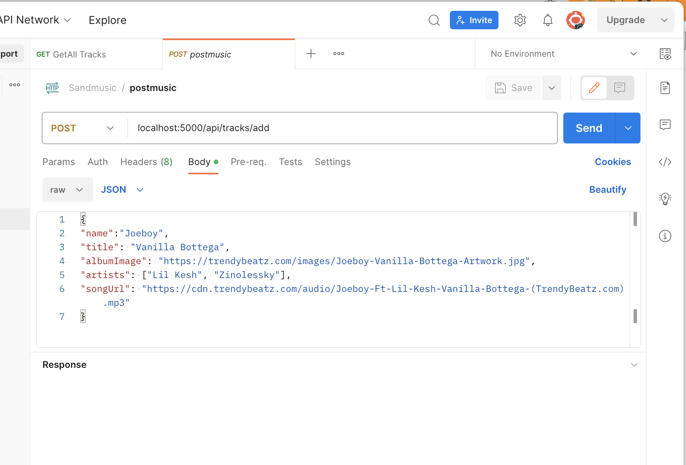

In this guide, we will walk through the process of building a secure backend for a music app using Node.js, Express, JWT (JSON Web Tokens), and bcrypt. This setup will handle user registration, login, and secure access to music tracks.

Overview

Technologies Used
Node.js: JavaScript runtime environment.
Express: Web framework for Node.js.
Mongoose: MongoDB object modeling for Node.js.
Bcrypt: Library to hash passwords.
JWT: Standard for creating secure tokens.
Dotenv: Module to load environment variables.
Nodemon: Utility to monitor changes in the code and automatically restart the server.

Project Structure
Here's a basic structure for the project:

sandmusic-backend/
│
├── controllers/
│   ├── UserControllers.js
│   ├── TrackController.js
│
├── middleware/
│   └── validateTokenHandler.js
│
├── models/
│   └── User.js
│   └── Track.js
│
├── routes/
│   ├── userRoutes.js
│   └── trackRoutes.js
│
├── .env
├── index.js
├── package.json
Setting Up the Project

Initialize the Project:
mkdir sandmusic-backend
cd sandmusic-backend
npm init -y

Install Dependencies:
npm install express mongoose dotenv bcrypt jsonwebtoken
npm install --save-dev nodemon
Environment Variables:

Create a .env file:
makefile
MONGO_URI=your_mongodb_connection_string
ACCESS_TOKEN_SECRET=your_jwt_secret_key
PORT=5000

Core Functionalities

User Registration and Login

The UserControllers.js handles user registration and login:

Register User: Hashes the password and saves the user to the database.
Login User: Validates the user credentials and generates a JWT token.
Token Validation Middleware

The validateTokenHandler.js middleware ensures secure access to protected routes by verifying the JWT token.

Secure API Routes
The userRoutes.js and trackRoutes.js define routes for user-related and track-related operations. Protected routes use the token validation middleware.

Example Usage
User Registration: Send a POST request to /api/users/register with displayName, email, password, and profileImage.
User Login: Send a POST request to /api/users/login with email and password to receive a JWT token.
Secure Access: Use the JWT token in the Authorization header to access protected routes.
Running the Server

To start the server, use:
npm run dev
This will run the server with nodemon, which will automatically restart the server on code changes.

